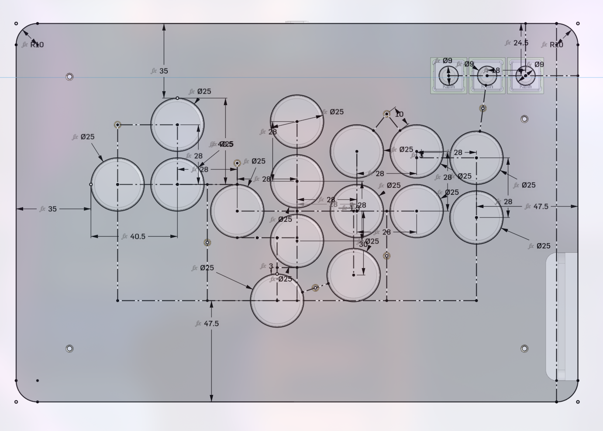
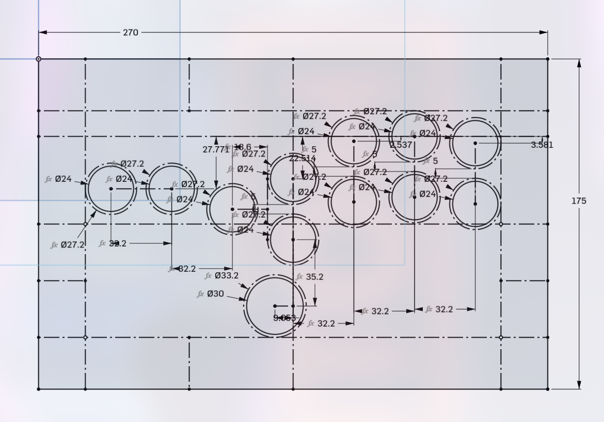

# Custom leverless fighting game controller
## What is this?

I built a video game controller to play fighting games with. It connects to a computer or game
console via USB-C, and sends button inputs as a PlayStation 4 controller. As of writing this, I've
been using it for ~4 months. It works great.

*Final result*

It's built out of grey PLA 3D printer filament and laser-cut acrylic for the
controller case, and transparent white PETG filament for the button keycaps. I designed and ordered
a custom PCB (**p**rinted **c**ircuit **b**oard) to connect each Kailh Low Profile Choc V2 key
switch to the Raspberry Pi Pico which sends input to the console using the
[GP2040-CE](https://gp2040-ce.info/) firmware.

## Why build this?

I love playing fighting games. Fighting games, as a genre, refer to 1v1 competitive video games in
which you aim to get your opponent's health to 0 before they can do the same to you. Think Street
Fighter, Tekken, Mortal Kombat.

I have been playing fighting games consistently since September 2023. Some notable results of mine
include 3rd at my local, FGSea, and 65th at EVO 2025 in Las Vegas. Fighting games take up a large
amount of my free time.

The fighting game genre is incredibly mechanically demanding. A signature characteristic of these
games are "motion inputs," input commands consisting of a motion on the joystick (i.e. a quarter
circle from the bottom to your character's forward direction) in addition to a button press, which
cause your character to perform a unique move. These motion inputs range from simple "command
normals," moves which only require a constant direction and a button, to "super" moves, which often
consist of complex motions.

I play Guilty Gear -STRIVE-, a 2D fighting game (think Street Fighter) which focuses on fast-paced
anime-esque duels which only last around 2 minutes per game. "Anime fighters" such as these require
such fast joystick inputs that some players have opted to replace their classic arcade-like joystick
controller (see below) with a similar one that breaks down the four directional inputs into four
distinct directional buttons. This allows very quick, abstracted motion on the controller's
"joystick." This style of controller is called a "leverless" controller, forsaking the classic
"lever" in favor of four buttons.

*Mad Catz T.E.3 Arcade Fight Stick*

I have built a leverless controller in the past. I used a
[Brook UFB Fusion](https://www.brookaccessory.com/products/ufbfusion/index.html) board to deliver
the electrical signals of the buttons to the console through a UART interface. I 3D-printed a case
for the board using black and white ABS, and I used Sanwa arcade buttons on the outside of the case.
However, the USB-C-to-USB-C cable terminal stopped working a few months after I began using the
controller at locals. I hacked together a chain of converters which adapted the Brook's USB-B UART
interface to a USB-A cable to plug into the console, however this cable was just not long enough to
effectively use.

*Old leverless*

I decided to cut my losses and build a new controller. My old leverless felt really clunky, and did
not fit easily in any controller bag. I had considered using a pre-built one, as many controller
manufacturers sell leverless controllers at less than $100. The cheapest option I found was around
$60, and I had anecdotes from friends that it was good *enough.* However, I had tried to use the
same model controller in the past, and it did not feel like the best fit for me. I had also just
come off of a robotics project designing 3D-printed structural parts. Both of these reasons
incentivized me to build my own custom controller in order to prioritize my ergonomic preferences.

My main goal for this controller was to create a device that I would not think twice about using. I
wanted to make it as slim and ergonomic as possible. This was not a project focused on learning - I
simply just wanted to make something that works very well for only me.

## How?
### Controller PCB

I had initially considered re-using my old controller's Brook board. It was convenient in that it
automatically detected the system that it was connected to, and spoke the proper protocol through
its UART interface. It also automatically authenticated the controller to the console. If the PCB
does not properly authenticate the controller, then the console becomes unresponsive to the
controller's inputs after around 8 minutes. This is colloquially referred to as the "8-minute
timeout," and can disqualify you from a tournament game or set if this occurs in bracket. I also
already had the Brook board on hand, so there was no additional cost in getting it set up. By all
means, the Brook board seemed like the best option.

However, there was a caveat. I could not find any 2D or 3D CAD drawings of the board. I had
intended to make this controller as slim as possible, so I wanted to dial in the design of the case
with as little margin for error as possible. For this reason, I did not trust my own measurements of
components, instead opting to stick with CAD models produced by the vendor themself.

While looking for Brook CAD models, I asked if someone has made one on the `/r/fightsticks` Discord
server, a server dedicated to the design and usage of fighting game controllers. There, I was
advised against using a Brook board in favor of GP2040-CE on an RP2040 micro controller board. This
seemed like a great alternative to Brook boards. You can buy a Raspberry Pi Pico for just $4 from
quite a few hobbyist electronics vendors. Additionally, GP2040-CE allows the use of per-button RGB
LED modules, among other nice-to-have features. I decided to use GP2040-CE on an RPi Pico.

### Switches

In order to make the controller as slim as possible, I decided to use
[Kailh Choc V2 Low Profile switches](https://www.kailh.net/collections/low-profile-switches/products/kailh-choc-v2-low-profile-switch-set)
to receive button presses and convert them into electrical signals. I chose these because they were
fairly cheap and quiet, and they're used in Haute devices, among other very slim controllers. They
are also commonly used in slim hobbyist keyboards, so it was easy to find existing PCB footprints
for them.

### Buttons

I 3D-printed keycaps out of transparent PETG filament. I chose this filament to allow the LEDs under
the switches to shine through the keycaps, as shown below. Buttons for use in-game were printed as
large, circular, flat keycaps to minimize the chances that my fingers would miss. Meanwhile, system
keys, such as "start" and "select," were printed as tall, narrow cylinder-like bits.

*Final controller, plugged in to my computer*

The Kailh switches use the normal "plus" profile that most mechanical keyboard switches use. This
caused me quite a few problems, however, as the error on the 3D printer caused slight variation in
the keycaps' switch joints, which caused some keycaps to be looser than others on the same switches.
This took a lot of trial and error, as well as printing time, to minimize the occurrence of, however
I never really solved the issue.

### Case

I designed the controller's case in Onshape, my CAD program of choice. I had experience with Onshape
in mechanical design; I had designed and successfully built a
[3D-printed swerve robot](https://github.com/heyallnorahere/pancake) in the software.

I designed most of the case to be 3D-printed (shown in black). I chose to 3D-print the majority of
the case's pieces because I had experience creating robust 3D-printed parts, and they hold up well
under a lot of stress if designed adequately. Of course, this controller wouldn't be intentionally
smashed on the ground, however I didn't want to unintentionally break the case while smacking
buttons fast.

I created large, flat pieces on the top and on the sides, which would be laser-cut out of clear or
frosted acrylic (shown in light gray). The large, clear panel on the top was to provide a
satisfying, smooth texture when I rested my hands on it, and also to allow pieces of art (stickers,
prints) to be inserted between the panel layer and the 3D-printed top plate.

On the sides, I created notches in the top and bottom plates to allow acrylic shields to slot in. I
cut these out of frosted acrylic because it was fairly cheap at the plastic store that I went to to
get the clear sheets, and it just looked cooler than more 3D-printed parts.

I also created a bar on the edge of the acrylic panel to put a keychain on. When I finished building
the controller, I attached a charm depicting the Guilty Gear character that I use, Anji Mito.

[*Final CAD assembly*](https://cad.onshape.com/documents/aba2c960a3e5510f5926282e/w/0d57f165bb6395cbb5d6fa38/e/a4139b9da1757131feb00a80)

I loosely based the button layout of my new controller off of my old one. There were several
modifications that I made, such as the inclusion of a thumb button next to "up," an extra button
above the PlayStation "square" button, and a system button above "down." After building this and
using the controller for nearly 4 months, I have not adapted to using the additional buttons.
However, they are helpful for niche use cases while practicing mechanically intense techniques in
STRIVE's training mode.

### Custom PCB and LEDs

I designed a custom circuit board using KiCad, an open-source piece of CAD software which allows one
to design their own circuit boards to be sent to manufacturing services. I used KiCad to design my
PCB, which I sent to PCBWay to manufacture.

*TODO: Insert screenshot of PCB design*

I found a footprint library for common keyboard switches. This library included one for the Kailh
switches, which I was easily able to adapt into my project. The PCB has mounts for 18 switches in
total, each mapped to the default pin of the button the switch represents.

The Raspberry Pi Pico can be mounted in two ways: removable Dupont headers or surface-mounting. I
decided to use Dupont headers for prototyping, even though they take more space. This was reflected
in my PCB design. I never ended up going back to reiterate on the PCB design, so even though I could
have optimized the space usage, I held off because of the overhead that comes with ordering a batch
of PCBs.

As I was about to submit my PCB to be manufactured, I thought to add RGB LEDs to the design, as
GP2040-CE had built-in support for controlling them. The Kailh switches conveniently have small
notches through the main body of the switch, allowing an LED to shine light through from the other
side of the PCB. SK6812-E LEDs seemed like the perfect fit for the job - reverse mount
surface-mounted LED chips designed for the kind of chaining that GP2040 performs. As an exercise
with PCB design, I created a footprint from the LED datasheet, and attached the LEDs to every switch
on the circuit board.

GP2040-CE does not provide any mechanism to avoid the 8-minute timeout on its own. It does, however,
have support for two authentication methods: passthrough USB dongle, and vendor hardware keys. USB
dongles fake the signature of an official Sony controller while allowing the firmware to handle
controller inputs directly. The other option requires the dumping of controller keys to the board's
firmware. I opted for the first one initially, and so I added a USB receptacle to the PCB's design.

### Assembly

The assembly process was fairly uneventful once the PCBs arrived. I drove to a plastics store to
pick up 4 large sheets of acrylic (2 per kind of acrylic * (clear + frosted)). I laser-cut the
acrylic parts, and printed the remaining parts out of grey PLA.

While assembling, I realized that I did not add ground planes around each screw hole in the PCB. I
was forced to use non-conducting hardware to bolt in the PCB, which thankfully I had in nylon M3
bolts and nuts.

## Major challenges

**8-minute timeout**. Even after attaching the USB dongle through the soldered-in USB receptacle,
the controller still experienced the dreaded 8-minute timeout on PS4 and PS5 consoles. I checked the
solder joints, the GP2040 configuration on the RPi, and the PCB traces, however I could not come up
with an explanation for why this was happening. A week before EVO 2025 in August, I was still
experiencing the issue at a local when my friend suggested I use dumped authentication keys from a
PS4 controller. When I got home that weekend, I went through the process of getting PS4
authentication keys into GP2040, thus solving the issue.

**Loose keys**. Even as I tried to mitigate the issue of keys popping off of the switches, it still
kept happening whenever I took my controller to an event. This is particularly noticable on the
tall, thin system keys, where it takes little force to knock them off of the switches. As of
writing, I still have not solved this issue.

**Transparent PETG burning while printing**. While printing the keys initially, the PETG stuck to
the hot end of the print head, creating burn artifacts and deforming the keys. I mitigated this
issue by applying a non-stick coating to the hot end before printing, although burn artifacts are
still slightly noticable on some keys I have on.

## What went well?

**Tariff dodging**. PCBWay operates and manufactures PCBs in China. I ordered PCBs on April 12th,
2025, just a week or two before the nastier tariffs came into effect. This order of PCBs only cost
me around $80, and with the minimum batch of 5 PCBs per order, this came out to $20 per PCB. If I
waited a little bit longer to order PCBs, the cost of this project would have ballooned out of
control. On the other hand, however, if I were mass-producing these controllers, the total cost of
the project would have been ~$60 in total, not accounting for 3D printing filament and M3 hardware.

**PCB worked on the first try**. I triple checked the traces of both the switches and LEDs in
relation to the RPi Pico before ordering. Due to this diligence in all aspects other than console
authentication, the first build of this controller worked as well as I could have hoped for,
functionally.

**Controller feels good to use**. I was initially slightly shocked by how small the buttons were. I
had made the layout of the buttons slightly more compact than it was on my previous controller.
However, several months down the line, using it feels second-nature.

**Looks cool as hell**. With the firmware's native support of these LED chips, and the transparent
keycaps, when plugged in, the keycaps give off the illusion that they themselves are glowing. I was
able to create my own custom color profile for the keys with GP2040's web configuration. This truly
made it feel like my own project.

## Lessons learned

**Use the simplest option when possible**. The 8-minute timeout was an issue in the first place
because I didn't want to dump keys from an official controller. In retrospect, I should have used
the option that was least prone to error with the scope of my experience that was specialized in
software.

**Stick with the original goal**. In retrospect, I should have stuck with making this controller as
slim as possible. I used Dupont headers on the Raspberry Pi initially for prototyping, however I
should have doubled down on the slimness aspect as soon as the USB port was rendered obsolete, and
ordered another iteration of the PCB with solder-mount joints for the Raspberry Pi.

## What's next?

**Secure down the buttons**. While diving deeper into controller design, I looked into how people
typically secure keycaps on controllers. The most common method that I can find is with lips on the
edges of the keycaps that slot into notches in the controller, keeping them from falling off. This
seems like a much more practical design than a simple friction fit, and would likely be the next
method that I would try in a second iteration.

**Make the case slimmer**. As it is right now, the controller barely fits in the laptop slot of my
backpack. In a second iteration, I would solder the Raspberry Pi directly onto the edge of the PCB,
and use a shorter micro USB to USB-C cable connecting the Raspberry Pi's UART port to the outside
of the case. I would also remove the USB receptable, as it is no longer necessary.
