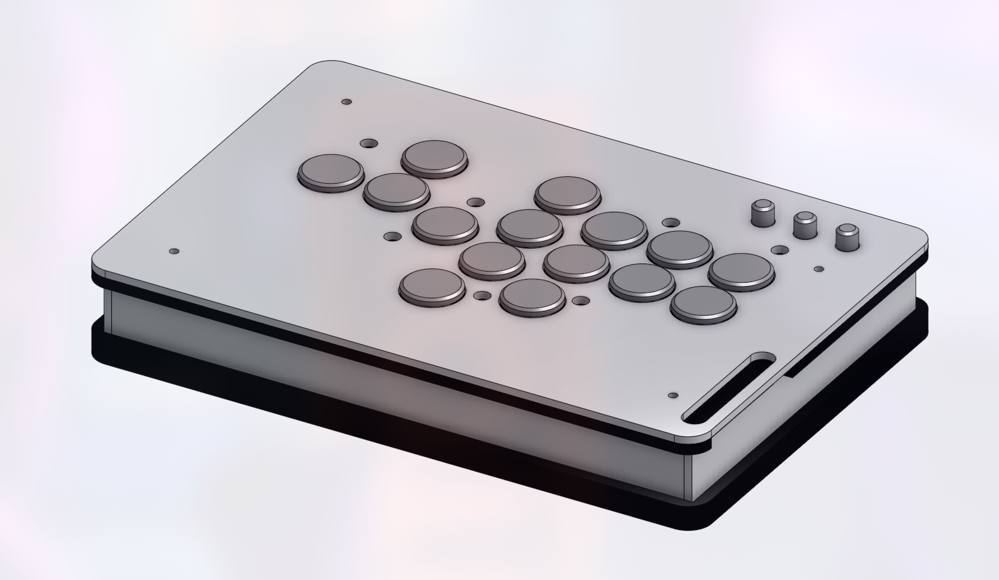

# Custom leverless fighting game controller
## What is this?

I built a video game controller to play fighting games with. It connects to a computer or game
console via USB-C, and sends button inputs as a PlayStation 4 controller.

*Final result*

It's built out of grey PLA 3D printer filament (todo: double check) and laser-cut acrylic for the
controller case, and transparent white PETG filament for the button keycaps. I designed and ordered
a custom PCB (**p**rinted **c**ircuit **b**oard) to connect each Kailh Low Profile Choc V2 key
switch to the Raspberry Pi Pico which sends input to the console using the
[GP2040-CE](https://gp2040-ce.info/) firmware.

## Why build this?

I love playing fighting games. Fighting games, as a genre, refer to 1v1 competitive video games in
which you aim to get your opponent's health to 0 before they can do the same to you. Think Street
Fighter, Tekken, Mortal Kombat.

I have been playing fighting games consistently since September 2023. Some notable results of mine
include 3rd at my local, FGSea, and 65th at EVO 2025 in Las Vegas. Fighting games take up a large
amount of my free time.

The fighting game genre is incredibly mechanically demanding. A signature characteristic of these
games are "motion inputs," input commands consisting of a motion on the joystick (i.e. a quarter
circle from the bottom to your character's forward direction) in addition to a button press, which
cause your character to perform a unique move. These motion inputs range from simple "command
normals," moves which only require a constant direction and a button, to "super" moves, which often
consist of complex motions.

I play Guilty Gear -STRIVE-, a 2D fighting game (think Street Fighter) which focuses on fast-paced
anime-esque duels which only last around 2 minutes per game. "Anime fighters" such as these require
such fast joystick inputs that some players have opted to replace their classic arcade-like joystick
controller (see below) with a similar one that breaks down the four directional inputs into four
distinct directional buttons. This allows very quick, abstracted motion on the controller's
"joystick." This style of controller is called a "leverless" controller, forsaking the classic
"lever" in favor of four buttons.

*Mad Catz T.E.3 Arcade Fight Stick*

I have built a leverless controller in the past. I used a
[Brook UFB Fusion](https://www.brookaccessory.com/products/ufbfusion/index.html) board to deliver
the electrical signals of the buttons to the console through a UART interface. I 3D-printed a case
for the board using black and white ABS, and I used Sanwa arcade buttons on the outside of the case.
However, the USB-C-to-USB-C cable terminal stopped working a few months after I began using the
controller at locals. I hacked together a chain of converters which adapted the Brook's USB-B UART
interface to a USB-A cable to plug into the console, however this cable was just not long enough to
effectively use.

*Old leverless*

I decided to cut my losses and build a new controller. My old leverless felt really clunky, and did
not fit easily in any controller bag. I had considered using a pre-built one, as many controller
manufacturers sell leverless controllers at less than $100. The cheapest option I found was around
$60, and I had anecdotes from friends that it was good *enough.* However, I had tried to use the
same model controller in the past, and it did not feel like the best fit for me. I had also just
come off of a robotics project designing 3D-printed structural parts. Both of these reasons
incentivized me to build my own custom controller in order to prioritize my ergonomic preferences.

My main goal for this controller was to create a device that I would not think twice about using. I
wanted to make it as slim and ergonomic as possible. This was not a project focused on learning - I
simply just wanted to make something that works very well for only me.

## How?
### Controller PCB

I had initially considered re-using my old controller's Brook board. It was convenient in that it
automatically detected the system that it was connected to, and spoke the proper protocol through
its UART interface. It also automatically authenticated the controller to the console. If the PCB
does not properly authenticate the controller, then the console becomes unresponsive to the
controller's inputs after around 8 minutes. This is colloquially referred to as the "8-minute
timeout," and can disqualify you from a tournament game or set if this occurs in bracket. I also
already had the Brook board on hand, so there was no additional cost in getting it set up. By all
means, the Brook board seemed like the best option.

However, there was a caveat. I could not find any 2D or 3D CAD drawings of the board. I had
intended to make this controller as slim as possible, so I wanted to dial in the design of the case
with as little margin for error as possible. For this reason, I did not trust my own measurements of
components, instead opting to stick with CAD models produced by the vendor themself.

While looking for Brook CAD models, I asked if someone has made one on the `/r/fightsticks` Discord
server, a server dedicated to the design and usage of fighting game controllers. There, I was
advised against using a Brook board in favor of GP2040-CE on an RP2040 micro controller board. This
seemed like a great alternative to Brook boards. You can buy a Raspberry Pi Pico for just $4 from
quite a few hobbyist electronics vendors. Additionally, GP2040-CE allows the use of per-button RGB
LED modules, among other nice-to-have features. I decided to use GP2040-CE on an RPi Pico.

### Switches

In order to make the controller as slim as possible, I decided to use
[Kailh Choc V2 Low Profile switches](https://www.kailh.net/collections/low-profile-switches/products/kailh-choc-v2-low-profile-switch-set)
to receive button presses and convert them into electrical signals. I chose these because they were
fairly cheap and quiet, and they're used in Haute devices, among other very slim controllers. They
are also commonly used in slim hobbyist keyboards, so it was easy to find existing PCB footprints
for them.

### Buttons

I 3D-printed keycaps out of transparent PETG filament. I chose this filament to allow the LEDs under
the switches to shine through the keycaps, as shown below. Buttons for use in-game were printed as
large, circular, flat keycaps to minimize the chances that my fingers would miss. Meanwhile, system
keys, such as "start" and "select," were printed as tall, narrow cylinder-like bits.

*Final controller, plugged in to my computer*

The Kailh switches use the normal "plus" profile that most mechanical keyboard switches use. This
caused me quite a few problems, however, as the error on the 3D printer caused slight variation in
the keycaps' switch joints, which caused some keycaps to be looser than others on the same switches.
This took a lot of trial and error, as well as printing time, to minimize the occurrence of, however
I never really solved the issue.

### Case

I designed the controller's case in Onshape, my CAD program of choice.

*Final CAD assembly*

### Custom PCB and LEDs

I designed a custom circuit board using KiCad, an open-source piece of CAD software which allows one
to design their own circuit boards to be sent to manufacturing services. I used KiCad to design my
PCB, which I sent to PCBWay to manufacture.

*TODO: Insert screenshot of PCB design*

I found a footprint library for common keyboard switches. This library included one for the Kailh
switches, which I was easily able to adapt into my project. The PCB has mounts for 18 switches in
total, each mapped to the default pin of the button the switch represents.

The Raspberry Pi Pico can be mounted in two ways: removable Dupont headers or surface-mounting.

As I was about to submit my PCB to be manufactured, I thought to add RGB LEDs to the design, as
GP2040-CE had built-in support for controlling them. The Kailh switches conveniently have small
notches through the main body of the switch, allowing an LED to shine light through from the other
side of the PCB. SK6812-E LEDs seemed like the perfect fit for the job - reverse mount
surface-mounted LED chips designed for the kind of chaining that GP2040 performs. As an exercise
with PCB design, I created a footprint from the LED datasheet, and attached the LEDs to every switch
on the circuit board.

GP2040-CE does not provide any mechanism to avoid the 8-minute timeout on its own. It does, however,
have support for two authentication methods: passthrough USB dongle, and vendor hardware keys. USB
dongles fake the signature of an official Sony controller while allowing the firmware to handle
controller inputs directly. The other option requires the dumping of controller keys to the board's
firmware. I opted for the first one initially, and so I added a USB receptacle to the PCB's design.
